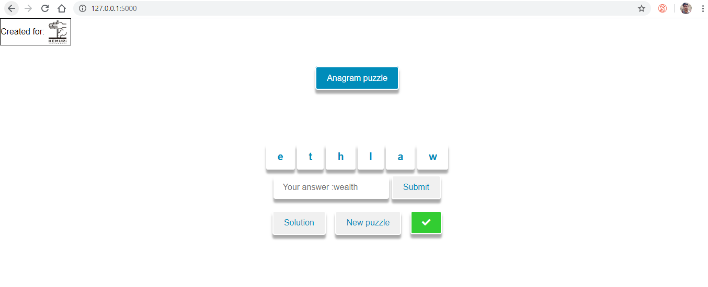

# kemuri_test - a small anagram puzzle created for Kemuri Technology</h2>

<h3>Requirement(s):</h3>
<ol>
<li>Create puzzle(s) from open source project (at least 2k+ stars)</li>
<li>Puzzle(s) should be in the format of "fill in the blank"; only single blank is required</li>
</ol>

<h3>Compatibility:</h3>
'Anagram puzzle' is created via popular micro-framework 'Flask' and is compatible with python-3.

<h3>Sample screenshots:</h3>

<p align="center">
  
</p>

<h3>Setup:</h3>

```
  git clone https://github.com/Shivanshu26shiv/kemuri_test
  cd kemuri_test
  pip install Flask==1.1.1
  python app.py
```

<h3>Contact:</h3>
<ul>
<li>LinkedIn: https://www.linkedin.com/in/shivanshu26shiv/</li>
</ul>
